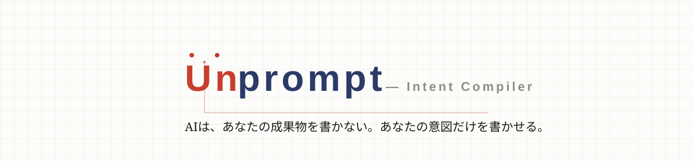
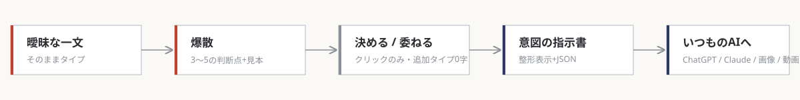
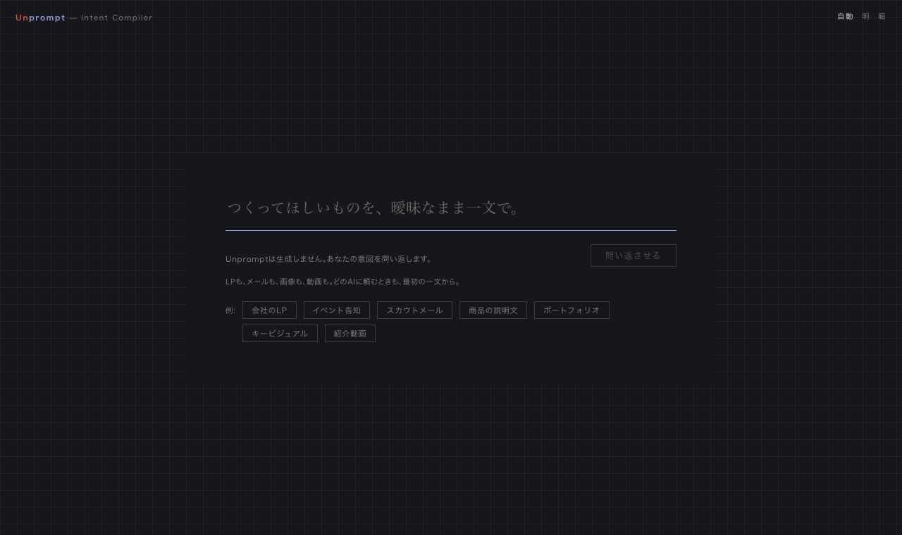

**曖昧な一文を、AIに渡せる「意図の指示書」にコンパイルする。** AIはあなたの成果物を書かない — あなたの一文がまだ決めていないこと (判断点) を実物の見本つきで問い返し、あなたは**決める**か**委ねる**かをクリックするだけ。最初の一文のあと、タイプは0文字。



## 60秒で試す

```sh
git clone https://github.com/Driedsandwich/unprompt-merge2026.git
cd unprompt-merge2026
python3 server.py        # → http://127.0.0.1:8321/
```

必要なもの: **Claude Code にログイン済みの環境だけ** (APIキー不使用・npm/ビルド不要・Python標準ライブラリのみ)。手っ取り早くは、**このリポジトリのURLを Claude Code に渡して「起動して」と頼むだけでも動きます**。ホームの例文チップ7種 (会社のLP / イベント告知 / スカウトメール / 商品の説明文 / ポートフォリオ / キービジュアル / 紹介動画) からワンクリックで始められます。



## 並置証明 — 同じAI、同じ一文。違いは指示書だけ

同じ画像生成AI (GPT-Image-2・同一設定) に、**左は一文をそのまま**、**右は Unprompt の指示書JSONをそのまま**貼った実生成結果:

| 一文をそのまま | 指示書JSONをそのまま |
|:---:|:---:|
|  |  |
| どの商品にもなり得る一枚 | ギフト・重厚・世界観・人物 — 決めた4つの判断点が全部絵に出る |

LP・メール・動画も含む全7ペアをアプリ内「この指示書で作らせた実例を見る」で確認できます (すべて事前実生成・生成条件と機械照合は [`app/compare/manifest.json`](app/compare/manifest.json) に記録)。

## 仕組み

| 観点 | 実装 |
|---|---|
| 判断点の抽出・見本・指示書 | Claude Code headless CLI (`claude -p`) をローカルで呼ぶ。実測モデルは画面の「処理の内訳」に正準ID表示 (例: claude-sonnet-5) |
| 動作範囲 | **127.0.0.1 のみ**。外部送信なし・APIキー不使用・レイテンシは等倍実測を表示 |
| 操作 | 動詞は2つ (決める / 委ねる)。一括は「ランダムに決める」「AIのおすすめで決める」 |
| 表示 | ライト/ダーク (自動・手動)。デザイン言語「朱と藍の製図」: 朱=未決・藍=確定・鼠=委任 |

## 誠実性 (このリポジトリの検証装置)

- [`docs/DISCLOSURE.md`](docs/DISCLOSURE.md) — 開示リスト21項 (事前生成・対照条件・既知不具合まで全列挙)
- [`PROCESS_LOG.md`](PROCESS_LOG.md) — AIの提案 / 人の判断 / 採否と理由の3列ログ
- [`EVIDENCE/`](EVIDENCE/) — キラーテスト実測・DOMテスト群 (900項目超)・レイテンシログ
- git log — `resolved: <判断点>→<決定> / 理由` タグつきコミット (この製品は、この製品の思考様式で作られています)

## 展開性

現状は「Claude Code サブスクを持つ任意のマシン」で動作。ホスティング/BYOK/他社モデル (OpenAI CLI・ローカルLLM) 対応の構造上の可能性と誠実な留保は [`docs/deck/DEPLOYMENT_FAQ.md`](docs/deck/DEPLOYMENT_FAQ.md) を参照。

---

<sub>MERGE 2026 AI Designathon 提出作品。旧称/コードネーム: GYAKUMON (逆問) — リポジトリ名・審議記録・機械マーカーは旧称のまま (二層命名、[DISCLOSURE #19](docs/DISCLOSURE.md))。Day1 キラーテスト・ハーネスの手順書は [`docs/README_killer_test_day1.md`](docs/README_killer_test_day1.md) に保存。</sub>

## ライセンス

権利は留保しつつ、**審査・評価・検証を目的とした閲覧・clone・ローカル実行・フォークを許諾**しています。詳細は [LICENSE](LICENSE)。
